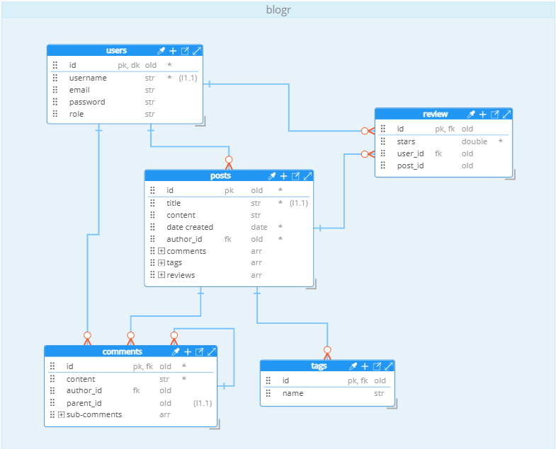
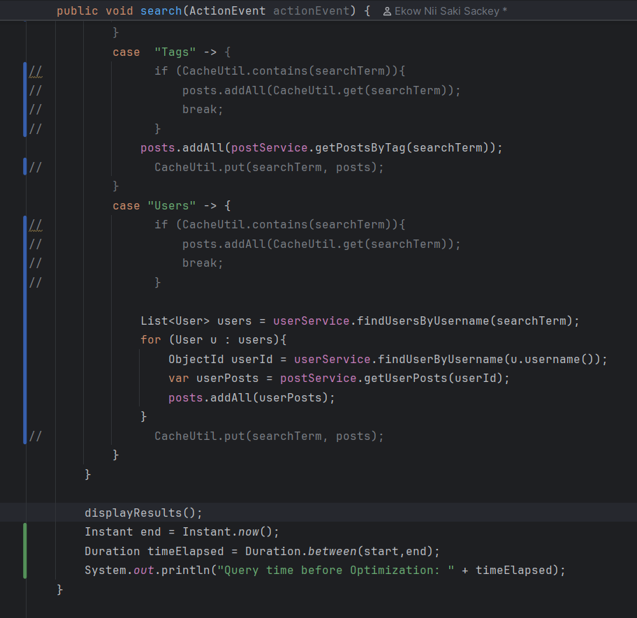
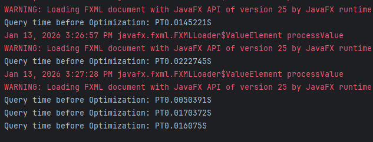
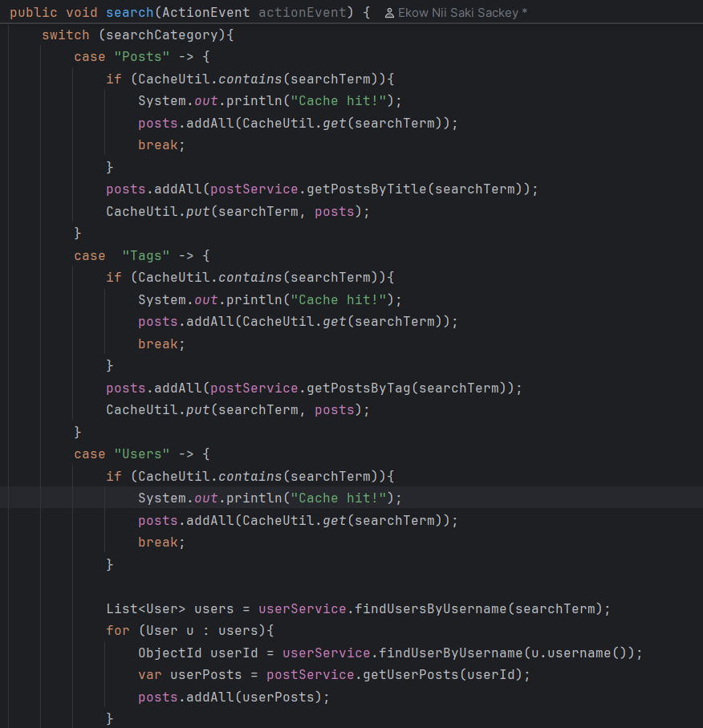
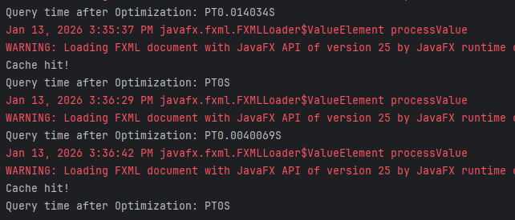

# Blogr

A desktop blog platform built with JavaFX.

Project Overview

ERD/ NoSql Schema Design


Evidence of Optimization

- Before



- After



Project status
- Desktop JavaFX app (module: `org.example.blogr`)
- Uses Maven for build and dependency management
- MongoDB is used as the database (default: localhost)

Requirements
- Java JDK: The project is configured with source/target = 25 in pom.xml and the IntelliJ project files indicate JDK 25.
- Recommended: install a JDK matching your environment (Temurin/AdoptOpenJDK/Oracle).
- Maven 3.8+ (for commands below)
- MongoDB running locally (unless you edit the MongoConfig)

Project configuration
- Build tool: Maven 
- JavaFX plugin: org.openjfx:javafx-maven-plugin (configured in pom.xml)
    - Plugin configuration sets mainClass to `org.example.blogr/org.example.blogr.BlogrApplication`
- Module name: `org.example.blogr` (module-info.java)
- Application class: `org.example.blogr.BlogrApplication` (extends javafx.application.Application)
- Launcher class: `org.example.blogr.Launcher` (contains public static void main)
- JavaFX dependencies in pom: javafx-controls, javafx-fxml, javafx-web, javafx-swing (v21.0.6)
- Additional libs: controlsfx, formsfx, tilesfx, ikonli, mongodb-driver-sync, jbcrypt, charm-glisten, validatorfx

Setup & run (development)

1) Clone
- git clone https://github.com/EkowSackey/blogr.git
- cd blogr

2) Ensure MongoDB is running (default)
- Start a local MongoDB instance listening on 27017 (or update MongoConfig as described below).

3) Run with Maven (recommended)
- Development run (uses javafx-maven-plugin configured in pom.xml):
    - mvn clean javafx:run
    - This uses the plugin's configured mainClass (module-aware format) to start the JavaFX application.

4) Run from an IDE
- Import the project as a Maven project.
- Ensure the project SDK is set to the same Java version configured in the pom / IDE.
- Run configuration options:
  - run `org.example.blogr.Launcher` (has a main that calls Application.launch), or run `org.example.blogr.BlogrApplication` as a JavaFX application.

Build & Run
1) Build with Maven
- mvn clean package
    - This produces artifacts in `target/`. The pom config uses the javafx-maven-plugin and includes jlink-related configuration (jlink image names, etc.), so the plugin can also create a custom runtime image.

2) Run
- Run the app with: mvn javafx:run

Configuration (MongoDB)
- Default connection: MongoConfig.getClient() returns a client using `mongodb://localhost:27017`.
- To point to a different MongoDB instance, either:
    - Edit src/main/java/org/example/blogr/Config/MongoConfig.java and replace the URI, or
    - Modify the code to read the URI from an environment variable (example shown below).

Example: make MongoConfig read env var (suggested change)
```java
String uri = System.getenv().getOrDefault("BLOGR_MONGODB_URI", "mongodb://localhost:27017");
```
Then you can run:
- BLOGR_MONGODB_URI="mongodb://db.example:27017" mvn clean javafx:run

Dependencies
- org.openjfx:javafx-controls:21.0.6
- org.openjfx:javafx-fxml:21.0.6
- org.openjfx:javafx-web:21.0.6
- org.openjfx:javafx-swing:21.0.6
- org.controlsfx:controlsfx:11.2.1
- com.dlsc.formsfx:formsfx-core:11.6.0
- eu.hansolo:tilesfx:21.0.9
- org.kordamp.ikonli:ikonli-javafx:12.4.0
- org.kordamp.ikonli:ikonli-fontawesome5-pack:12.4.0
- org.mongodb:mongodb-driver-sync (BOM 5.6.2 used)
- org.mindrot:jbcrypt:0.4
- net.synedra:validatorfx:0.6.1
- com.gluonhq:charm-glisten:6.2.3
  (See pom.xml for full list and versions)

  
Troubleshooting
- Error: "JavaFX runtime components are missing, and are required to run this application"
    - If running outside Maven, download JavaFX SDK (matching OS and JDK), then run with:
      --module-path /path/to/javafx-sdk/lib --add-modules javafx.controls,javafx.fxml,javafx.web
    - Or use `mvn javafx:run` which uses Maven dependencies.

- MongoDB connection refused
    - Ensure MongoDB is running (`mongod`) on the host and port used by MongoConfig, or update MongoConfig to point to the correct URI.

    
Contributing
- Fork the repository, create a feature branch:
    - git checkout -b feat/your-feature
- Open a pull request with a clear description and tests if applicable.
